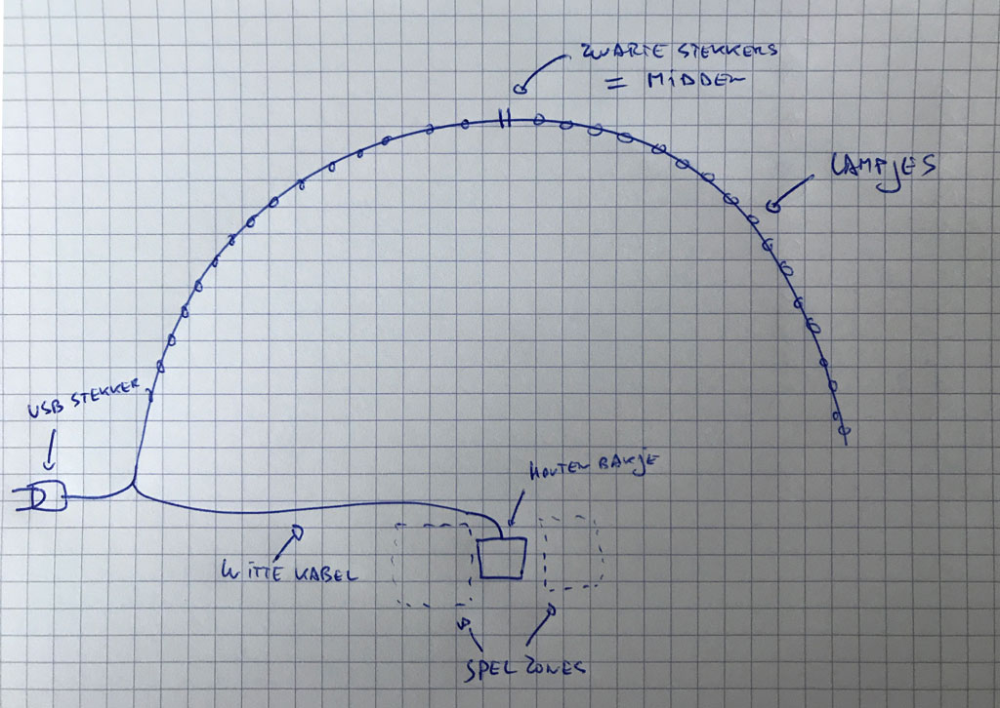
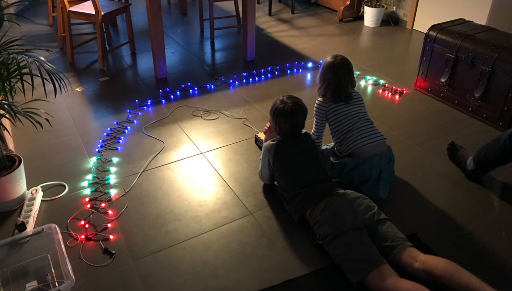

# Ledball
a two-player, one-dimensional, christmaslights action game

## bill of materials

- 2 hc-rs04 ultrasonic distance sensors
- arduino nano
- 100 ws8211 leds.
- power supply 5v (a 2a USB charging donge will do) 
- some wiring, capacitor (1000uF), resistor (470r)
- enclosure (see enclosure folder for dxf files)

## Connections and wiring

*coming soon*

## Setup

## Game rules

- The playing field is divided by the sensorbox in de middle.
- Player one takes place on the left, player two on the right.
- When no players are active, some random christmas lights blink on the string
- When a player activates the playing field by litteraly stepping in, his side of the led string tunrs blue. When another player steps in, the countdown begins
- The countdown is visible by white leds
- then the game begins: the playing field is marked by one blue neutral zone and two 'goals' with 10 yellow and 10 red leds. A white led, being the ball, moves from one side to the other.
- a player has to step, or move before his or hers sensor when the white led is in the yellow or red zone on his side. When he is too early or too late, he will lose a point.
- When a player waits until the white led is in the red zone before stepping in, the led accelerates towards the other player.
- After five misses, a player looses and the other player wins, this is marked by a rainbow on the side of the winning player.
